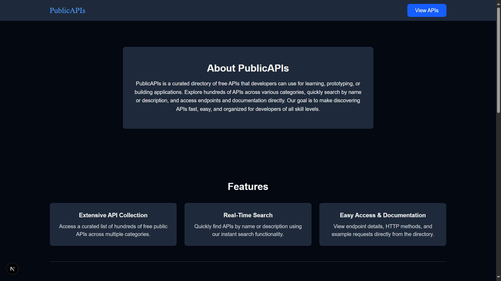
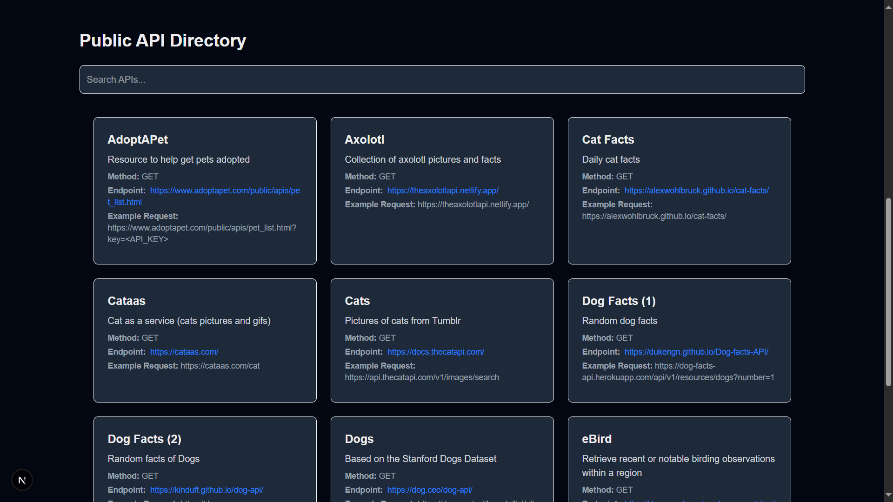
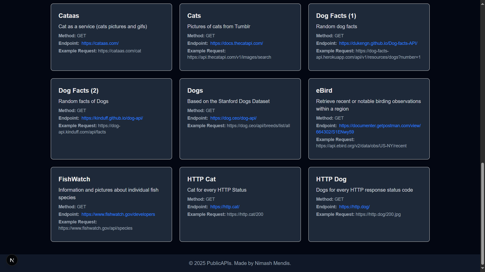

# PublicAPIs

A **Next.js 14** app that serves as a curated directory of free public APIs. Explore, search, and access API endpoints with ease. Built with **TypeScript**, **TailwindCSS**.

---

## Demo

Demo Link [PublicAPIs Link](https://public-apis-amber.vercel.app)

---

## Features

- **Extensive API Collection**: Access hundreds of free APIs across multiple categories.
- **Real-Time Search**: Quickly find APIs by name or description.
- **Easy Access & Documentation**: View endpoints, HTTP methods, and example requests directly from the directory.
- **Responsive Design**: Works on mobile, tablet, and desktop.

---

## Images





## About

PublicAPIs is a curated directory of free APIs for developers. You can explore APIs across various categories, search in real-time, and view endpoint details including example requests. It’s designed to make discovering APIs fast, easy, and organized.

---

## Tech Stack

- [Next.js 14](https://nextjs.org/)
- [TypeScript](https://www.typescriptlang.org/)
- [TailwindCSS](https://tailwindcss.com/)
- JSON for API data storage

---

## Getting Started

1. Clone the repository:

```bash
git clone https://github.com/n1cKar/public-apis.git
cd public-apis
```

2. Install dependencies:

```bash
npm install
# or
yarn install
```
3. Run the development server:

```bash
npm run dev
# or
yarn dev
```
4. Open http://localhost:3000 in your browser to vist.


## Contact

Created by [Nimash Mendis](https://github.com/n1cKar).  
Feel free to reach out for questions, feedback, or collaboration!
email: nimash.mendis0202@gmail.com

